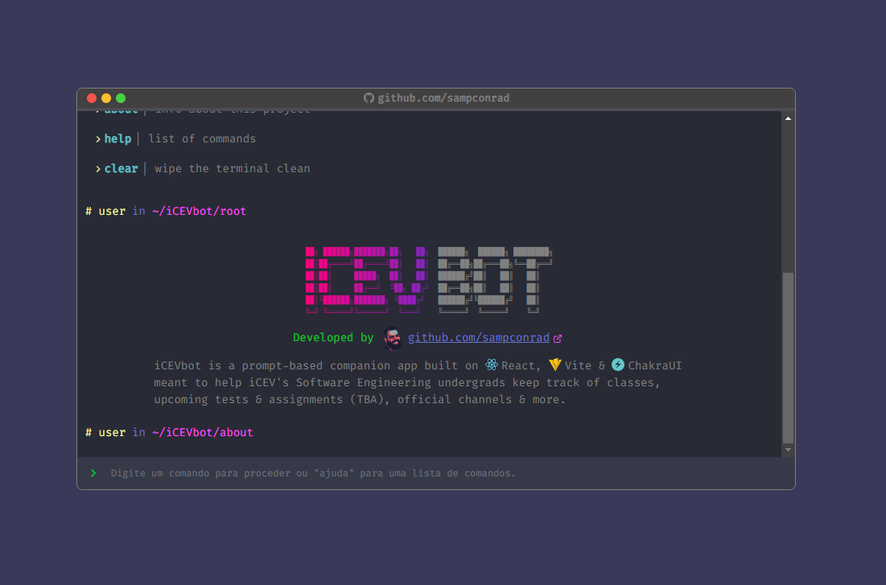

# interactive-terminal-portfolio

Demo: https://icevbot.netlify.app/

## About

iCEVbot is a prompt-based companion app built on React, Vite & ChakraUI meant to help iCEV's Software Engineering undergrads keep track of classes, upcoming tests & assignments (TBA), official channels & more.

## Using npm

Run commands

1. `npm install`

2. `npm run dev`

## Or using yarn

Run commands

1. `npm install --global yarn`

2. `yarn install`

3. `yarn run dev`

## DISCLAIMER

This project is in no way affiliated with, authorized, maintained, sponsored or endorsed by iCEV or any of its affiliates or subsidiaries. This is an independent and unofficial software. Use at your own risk.
